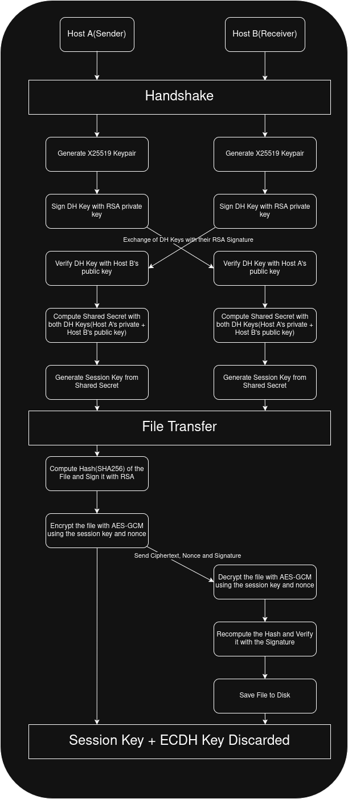

# Secure File Transfer Protocol

This project implements a Secure File Transfer Protocol allowing two peers to transfer files over an authenticated, encrypted channel. It uses X25519 ECDH for ephemeral key exchange, RSA-2048 for mutual authentication of the handshake, HKDF for session key derivation, and AES-256-GCM for authenticated encryption — providing per-transfer forward secrecy and protection against tampering, replay, and man-in-the-middle attacks.

---

## Project Structure

```
filet/
├── crypto/
│   ├── rsa.py               # RSA key generation, signing and verification
│   ├── ecdh.py              # X25519 ECDH keypair generation and shared secret
│   ├── session.py           # HKDF session key derivation
│   └── aesgcm.py            # AES-256-GCM encryption and decryption
├── transport/
│   └── socket_transport.py  # TCP message framing (length-prefixed send/receive)
├── protocol/
│   ├── handshake.py         # ECDH key exchange authenticated via RSA
│   ├── sender.py            # File hashing, signing and encrypted transfer
│   └── receiver.py          # Receive, decrypt and verify transferred files
├── main.py                  # Entry point, listener thread and CLI
├── generate_keys.py         # One-time RSA keypair generation for both peers
├── Dockerfile               # Container image definition
├── docker-compose.yml       # Two peer containers on isolated Docker network
└── requirements.txt         # Python dependencies
```

---

## Flow Diagram



---

## How It Works

```
1. Both peers load their RSA private key and the other peer's RSA public key
2. A fresh X25519 ECDH keypair is generated for each transfer
3. Each peer signs their ECDH public key with their RSA private key and sends it
4. Each peer verifies the received ECDH public key using the other's RSA public key
5. Both peers independently derive the same shared secret via ECDH
6. The shared secret is passed through HKDF to produce a 32-byte session key
7. The sender hashes the file with SHA-256 and RSA-signs the hash
8. The file is encrypted with AES-256-GCM using the session key
9. The receiver decrypts the file, recomputes the hash and verifies the signature
10. Session key and ECDH keypairs are discarded — never reused
```

---

## Why Each Primitive

**X25519 over classic DH** — X25519 is faster, uses compact 32-byte keys, requires no parameter negotiation, is resistant to timing attacks, and is the current modern standard over legacy DH.

**RSA for signing, not encryption** — RSA is too slow and has a size limit for bulk data. AES-GCM is far more efficient for encrypting files. RSA's asymmetric property makes it ideal for authentication — only the private key holder can produce a valid signature.

**HKDF instead of raw shared secret** — the raw ECDH output has mathematical structure and is not uniformly random. HKDF extracts and expands it into a clean, uniformly random 32-byte session key suitable for AES-256-GCM.

**AES-256-GCM** — authenticated encryption (AEAD) that produces an authentication tag verifying both integrity and authenticity of the ciphertext during decryption. Tampering is automatically detected without a separate MAC.

**PSS over PKCS1v15** — PSS uses random salt making each signature unique even for the same data, protecting against pattern analysis and known mathematical attacks. PKCS1v15 is deterministic and has known vulnerabilities making it the legacy choice.

---

## Threat Model

### Attacks Defended Against

**Man-in-the-Middle (MITM)**
Each peer signs their ECDH public key with their RSA private key before sending. The receiver verifies the signature using the sender's hardcoded RSA public key. An attacker cannot forge a valid signature without the private key, so any attempt to swap the ECDH public key in transit is detected and rejected.

**Tampering**
AES-256-GCM is authenticated encryption — it produces an authentication tag that covers the ciphertext. If any byte of the ciphertext is modified in transit, decryption fails and an InvalidTag exception is raised.

**Repudiation**
The sender RSA-signs the SHA-256 hash of the plaintext file before sending. The receiver verifies this signature after decryption. This proves the file genuinely came from the claimed sender and has not been modified.

**Replay Attacks**
Each transfer uses a freshly generated X25519 ECDH keypair. The session key is derived from the ephemeral shared secret via HKDF and is unique to every transfer. A recorded session cannot be replayed because the session key is never reused.

### Per-Transfer Forward Secrecy
ECDH keypairs are ephemeral — generated fresh for every transfer and discarded immediately after. If a long-term RSA private key is ever compromised, past transfers remain secure because the ephemeral ECDH private keys no longer exist.

### Limitations
- RSA public keys are hardcoded — there is no Certificate Authority. Adding a new peer requires manually distributing public keys out of band.
- No protection against a compromised endpoint — if a peer's machine is compromised, the attacker has access to the RSA private key and all future transfers.

---

## How to Run

### Prerequisites
- Docker
- Docker Compose
- Python 3.12+

### 1. Generate RSA keys (run once)
```bash
python3 generate_keys.py
```

### 2. Build and start containers
```bash
docker-compose build
docker-compose up -d
```

### 3. Shell into both containers (two terminals)
```bash
# Terminal 1
docker exec -it host_a /bin/bash

# Terminal 2
docker exec -it host_b /bin/bash
```

### 4. Run the program
```bash
# Always start the receiver first, then the sender
python main.py
```

### 5. Send a file
```
# In either terminal type:
send

# Then enter the filepath:
files/yourfile.txt
```

The received file will appear in `/files/` on the receiver machine.

---

## Built With
- Python 3.12
- [cryptography](https://cryptography.io/en/latest/) library
- Docker
